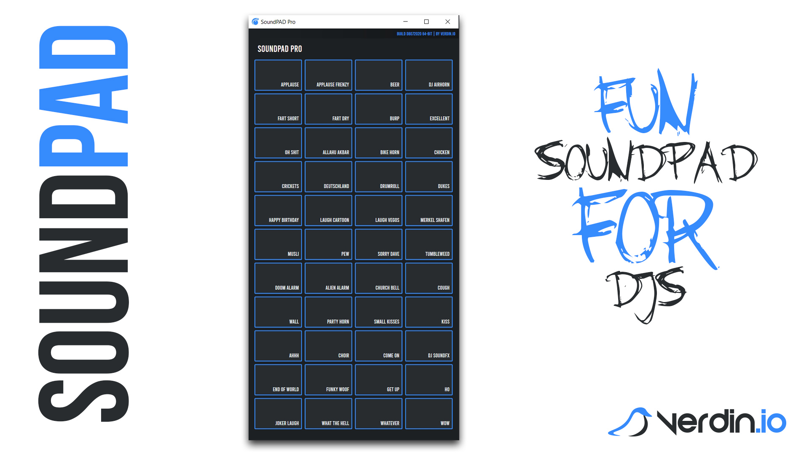

# SoundPAD pro
SoundPAD is a simple app playing sound effects for amateur DJs.

SoundPAD is compatible with Windows 10 and utilizes the .NET framework 4.8.

It's open source and you can have fun using it for free.

